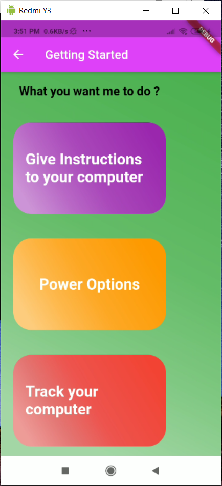

# Personal Assistant Project

## About 

It is a system which is designed to control and track your PC remotely. 

Features : 
1. Give Instructions to your PC remotely using mobile device or microphone.
2.  You can give instructions to your pc using mobile application from anywhere around the world.
3. Track system details such as batter, CPU Usage etc. You can also take a screenshot from your webcam to monitor who is using your pc.

## Project Comprises of three Parts
### Note: This repository has three branches for three different codebases.
1. Mobile Application (On master Branch )
2. Django Backend Server (On BackendServer Branch)
3. Python App (On pythonbackend Branch)

## How to deploy this whole system ?

## Django Application
Use the commands given below

~~~
pip install django
python manage.py runserver
~~~

## Mobile Applications
Make sure to have flutter and android studio installed
~~~
flutter clean
flutter pub get
flutter run

~~~

## Python App
Python App
~~~
python runfile.py
~~~

### Make sure to run all these three simultaneously so that app functions properly 

## Mobile Application Screenshots

<table>
  <tr>
    <td>Home Page</td>
     <td>Help Screen</td>
     <td>Main Screen</td>
  </tr>
  <tr>
    <td></td>
    <td></td>
    <td></td>
  </tr>
 </table>

<table>
  <tr>
    <td>Chat Screen</td>
     <td>System Tracking Screen</td>
     <td>Web Cam Image Access Screen</td>
  </tr>
  <tr>
    <td></td>
    <td></td>
    <td></td>
  </tr>
 </table>

 

